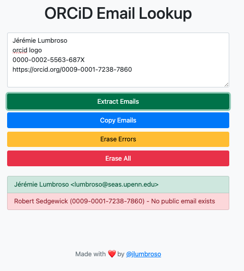

# ORCiD Email Lookup

The ORCiD Email Lookup is a simple web-based tool that allows you to extract email addresses associated with ORCiD (Open Researcher and Contributor ID) identifiers from a given text. This tool is particularly useful for cross-referencing and deduplicating email lists, such as those used in academic conferences or research communities.

Here is an example using my ORCiD (0000-0002-5563-687X) and Bob Sedgewick's ORCiD (0009-0001-7238-7860):

## Features

- Extract ORCiD identifiers from a given text
- Retrieve the associated name and — if publicly available — email address for each ORCiD using the ORCiD API
- Display the extracted emails in a list, categorized as success or error
- Copy all successfully retrieved emails to the clipboard with a single click
- Erase errors or clear the entire email list

## Usage

1. Open [the online web page](https://jlumbroso.github.io/orcid-lookup/), or clone the repository and open the `index.html` file in a web browser.
2. Paste the text containing ORCiD identifiers into the provided text area.
3. Click the "Extract Emails" button to retrieve the associated email addresses.
4. Use the "Copy Emails" button to copy all successfully retrieved emails to the clipboard.
5. If needed, use the "Erase Errors" or "Erase All" buttons to manage the displayed email list.

## Implementation Details

The ORCiD Email Lookup tool is built using HTML, CSS (Bootstrap), and JavaScript. The main functionality is implemented in the `app.js` file, which includes the following functions:

- `getEmailFromORCiD(orcid)`: Retrieves the email address associated with a given ORCiD using the ORCiD API.
- `extractEmails()`: Extracts ORCiD identifiers from the input text and retrieves the associated email addresses, displaying them in the email list.
- `copyEmails()`: Copies all successfully retrieved emails to the clipboard.
- `eraseErrors()`: Removes all error entries from the email list.
- `eraseAll()`: Clears the entire email list.

## Credits

This tool was designed and implemented by [Jérémie Lumbroso](https://github.com/jlumbroso) to assist with the organization of the SIGCSE Technical Symposium 2025 and was inspired by Libby Shoop, who spearheaded the adoption of ORCiDs to streamline efficiencies within the organization of SIGCSE.